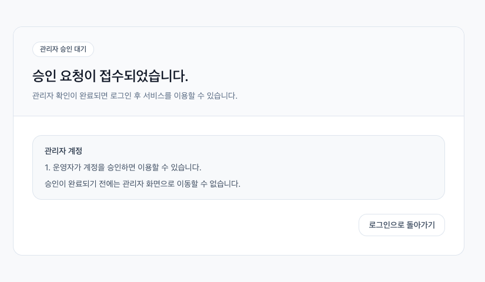
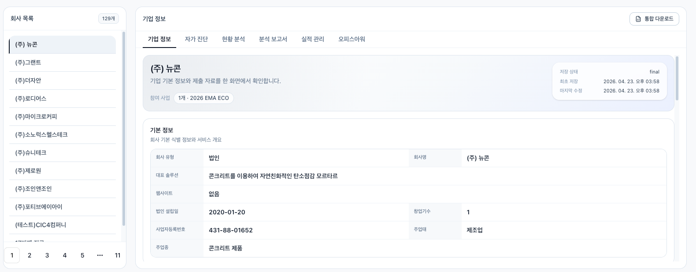
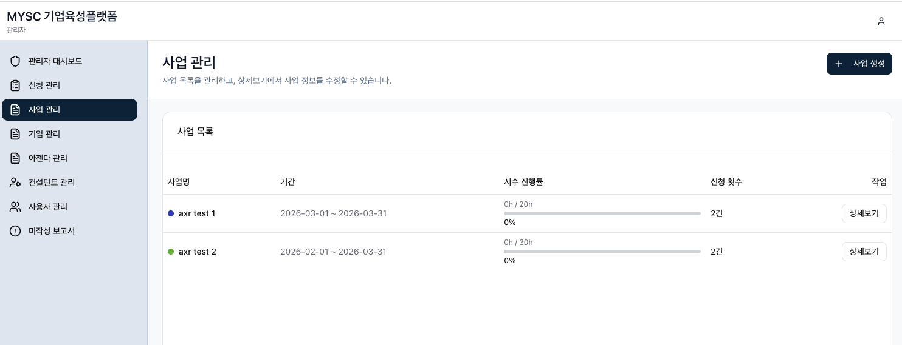

# 스타트업 진단 플랫폼 운영/QA 가이드

이 문서는 개발자가 아닌 일반 사용자(회사, 컨설턴트, 어드민)가 **회원가입부터 기능 사용까지** 쉽게 이해하고 QA를 수행할 수 있도록 작성되었습니다.  
UI에서 **숨겨져 있거나 비노출된 기능(Labs 등)은 설명에서 제외**했습니다.

---

## 관리자용 기업육성 플랫폼 가이드

이 섹션은 `기업육성플랫폼_관리자용_사용가이드_MYSC양식_20260430.pptx`의 내용을 바탕으로 정리했습니다.  
PPTX에 포함된 이미지는 `docs/assets/admin-guide/`에 추출되어 있으며, 아래 대표 이미지를 README에서 바로 확인할 수 있습니다.


**Why 기업육성 플랫폼?**

EMA Station은 새로운 입력 화면을 하나 더 만든 것이 아니라, MYSC의 기업육성 데이터를 기업 단위로 연결하고 자산화하기 위한 운영 기준입니다. 기업 정보, 진단 결과, 멘토 의견, 보고서, KPI가 사업별 파일과 채널에 흩어지지 않도록 같은 구조로 쌓는 것이 핵심입니다.

먼저 확보해야 하는 가치는 단순 편의성이 아니라 **관리 가능성, 책임성, 데이터 축적**입니다. 누가 어떤 근거로 기업을 판단했고, 다음 지원에서 무엇을 확인해야 하는지 남겨야 담당자가 바뀌어도 기업의 맥락이 이어집니다.

**관리자 가입 및 권한**

- 관리자는 회원가입 시 role을 `관리자`로 선택합니다.
- 관리자 계정은 일반 계정과 분리해 확인할 수 있도록 MYSC 계정 앞자리에 `_admin`을 붙여 생성합니다.
- 운영 전에는 사용자가 가입했는지, 승인되었는지, role이 실제 업무와 맞는지, 이름 또는 컨설턴트명이 정상 표시되는지 순서대로 확인합니다.



**기업 현황 관리 흐름**

기업육성 플랫폼의 핵심 흐름은 아래 순서로 이어집니다.

1. 회원가입
2. 기업정보 입력
3. 자가진단 작성
4. 현황분석 작성
5. AI 초안 생성
6. 최종보고서 저장 및 다운로드

자가진단은 기업이 작성하고, 현황분석과 보고서 검토는 멘토 또는 사업담당자가 작성합니다. AI 분석보고서는 입력값을 정리하는 보조 기능이며, 최종 저장과 외부 공유 판단은 담당자가 책임집니다.



**관리자 운영 체크포인트**

- **기업 기본정보:** 사업명, 기업 한 줄 소개, 기업소개자료 링크, 비고성 정보가 실제 필드에 저장되어 있는지 확인합니다.
- **자가진단:** 문제, 솔루션, 비즈니스, 자본조달, 팀, 임팩트 6개 영역이 최종 저장되었는지 확인합니다.
- **현황분석:** 기업의 자기진단에 대해 담당자가 동의 여부, 보완 의견, 미팅 전 확인 아젠다를 남겼는지 확인합니다.
- **AI 분석보고서:** 초안을 그대로 확정하지 않고 프로그램 목적, 예산, 지원 가능 범위와 맞는지 검토합니다.
- **사업관리:** 참여 기업, 내부/외부 오피스아워 티켓 기준, 사업별 KPI를 관리합니다.
- **기업관리:** 기업별 기본 정보, 자가진단표, 현황분석, 분석 보고서, 실적, 업로드 자료, 오피스아워 티켓 현황을 통합 관리합니다.
- **아젠다 관리:** 사업별 오피스아워 아젠다 추가, 수정, 담당자 배정을 확인합니다.
- **컨설턴트 관리:** 컨설턴트 기본 정보, 전문 분야, 프로필, 활동 상태를 관리합니다.
- **사용자 관리:** 기업, 컨설턴트, 관리자 계정의 승인 상태와 역할 정보를 관리합니다.
- **미작성 보고서:** 오피스아워 종료 후 아직 작성되지 않은 컨설팅 보고서를 추적합니다.



---

**문서 목적**
1. 역할별로 어떤 화면이 보이는지 정리합니다.
2. 각 화면에서 무엇을 확인해야 하는지 단계별로 안내합니다.
3. QA 담당자가 기능별 체크를 빠르게 할 수 있도록 합니다.

---

**역할 요약**
- 회사(기업) 사용자: 오피스아워 신청 및 일정 확인
- 컨설턴트: 신청 검토/수락/거절 및 일정 관리, 보고서 작성
- 어드민: 전체 운영 관리, 사용자 승인, 프로그램/아젠다/컨설턴트 관리

---

전체 다이어그램 
**회원가입 · 승인 · 로그인 흐름**
1. 회원가입을 진행하면 **승인 대기 상태**가 됩니다.
2. 어드민이 **사용자 관리 > 가입 승인 대기**에서 승인해야 역할이 확정됩니다.
3. 승인 완료 후 로그인하면 **역할에 맞는 메뉴**가 표시됩니다.
4. 회사 계정은 회사 정보가 연결되지 않으면 승인되지 않습니다.  

QA 체크 포인트
- 가입 직후 **가입 승인 대기 목록**에 나타나는지 확인
- 어드민 승인 후 역할이 올바르게 적용되는지 확인
- 승인 전에는 역할 메뉴가 제한되는지 확인

---

**공통 UI**
- 상단 우측 프로필 아이콘에서 **프로필 설정**, **로그아웃** 가능
- 회사 사용자는 프로필 메뉴에서 **기업 정보 입력**으로 이동 가능
- 좌측 메뉴는 역할에 따라 다르게 표시됨

---

**회사(기업) 사용자 가이드**

**1) 대시보드: 오피스아워 일정**
1. 헤더에 회사명이 표시됩니다.
2. 좌측에 **티켓 현황(내부/외부, 예약/완료)**이 보입니다.
3. **참여 사업** 배지 목록이 표시됩니다.
4. **대기중인 신청**과 **거절된 신청** 카드가 보이고, 클릭 시 상세로 이동합니다.
5. 중앙 캘린더에서 **확정/완료 일정**이 색상으로 표시됩니다.
6. 날짜를 클릭하면 우측 패널에 해당 날짜의 일정 목록이 표시됩니다.
7. 우측 패널의 일정 카드를 클릭하면 신청 상세로 이동합니다.
8. 상단의 **정기 오피스아워 신청** 버튼으로 신청 페이지 이동합니다.

QA 체크 포인트
- 티켓 수치가 신청 상태에 따라 반영되는지 확인
- 거절 사유가 있는 경우 카드에 표시되는지 확인
- 캘린더 날짜 이동(이전/오늘/다음)이 정상인지 확인

**2) 정기 오피스아워**
1. 상단에서 **캘린더/리스트** 뷰를 전환합니다.
2. **아젠다 필터**로 원하는 주제만 표시할 수 있습니다.
3. 날짜를 클릭하면 해당 날짜의 세션을 확인할 수 있습니다.
4. 세션의 **상세 보기**를 클릭하면 상세 페이지로 이동합니다.

**3) 정기 오피스아워 상세**
1. 탭 구성: **기본 정보 / 신청하기 / 확정 일정**
2. 기본 정보에서 설명 및 신청 가능 날짜를 확인합니다.
3. 신청하기 탭에서 **신청 시작하기** 버튼을 누릅니다.
4. 확정 일정 탭에서 확정된 일정과 상태를 확인합니다.
5. 확정 일정 카드에서 **전달사항(신청 상세)**로 이동 가능합니다.

**4) 정기 오피스아워 신청(마법사)**
1. 아젠다 선택 단계에서 내부/외부 티켓 잔여 여부가 표시됩니다.
2. 날짜/시간을 선택합니다.
3. 진행 방식(온라인/오프라인)을 선택합니다.
4. 요청 내용을 입력합니다.
5. 확인 후 **신청 제출**을 누릅니다.

QA 체크 포인트
- 잔여 티켓이 없으면 다음 단계로 진행 불가
- 필수 입력값이 없으면 다음 버튼 비활성
- 제출 후 신청 상태가 **진행중/검토**로 표시되는지 확인

**5) 비정기 오피스아워**
1. 상단 **새 컨설팅 신청** 버튼으로 신청 시작
2. 분야별 카테고리 카드와 검색 UI 확인
3. 하단 **신청 방법** 설명 섹션 확인

**6) 비정기 오피스아워 신청(마법사)**
1. 프로젝트 선택
2. 컨설팅 유형(내부/외부) 선택
3. 아젠다 선택
4. 희망 기간 및 요청 내용 입력
5. 확인 후 신청 제출

QA 체크 포인트
- 내부/외부 티켓 부족 시 안내 표시
- 제출 후 신청이 목록에 표시되는지 확인

**7) 신청 내역**
1. 뷰 전환: **타임라인 / 캘린더 / 그리드**
2. 검색(주제/컨설턴트)과 상태 필터 동작 확인
3. 신청 카드를 클릭하면 상세로 이동합니다.

**8) 신청 상세**
1. 상단에 상태, 담당 컨설턴트, 일정 정보가 표시됩니다.
2. 신청 내용과 아젠다, 요청 내용 확인
3. **전달사항** 탭에서 메시지 작성 및 파일 첨부 가능
4. 회사 사용자는 **진행중/검토 상태에서만 취소 가능**
5. 거절 사유가 있는 경우 상세에 표시됩니다.

**9) 기업 정보 입력**
1. 기업 기본 정보를 입력합니다.
2. 저장 후 어드민 승인에 필요한 정보가 연동됩니다.

**10) 설정(프로필 설정)**
1. 상단 프로필 메뉴에서 진입합니다.
2. 계정 정보 및 기본 설정을 확인합니다.

---

**컨설턴트 가이드**

**1) 담당 사업 현황(대시보드)**
1. 전체 신청 현황과 상태별 수치를 확인합니다.
2. 우선 처리 카드에서 **검토 필요 신청**으로 이동할 수 있습니다.
3. 최근 활동 목록에서 신청 상세로 이동합니다.

**2) 내 일정 캘린더**
1. 월/주 뷰에서 일정 확인
2. 상단 필터(사업/아젠다)로 일정 정리
3. 대기 요청 목록에서 신청을 **수락/거절** 가능
4. 일정 카드를 클릭하면 상세 화면으로 이동

QA 체크 포인트
- 내 담당 아젠다의 신청만 보이는지 확인
- 수락 시 상태가 **확정**으로 변경되는지 확인
- 거절 시 사유 입력이 필수인지 확인

**3) 신청 관리**
1. 신청 목록을 검색/필터로 확인
2. 상세보기에서 신청 내용을 확인
3. 컨설턴트 계정은 **수락/거절/재검토** 액션이 노출됨

**4) 내 정보 입력 + 스케줄 설정**
1. 프로필 필수 정보를 입력하고 저장
2. 스케줄에서 화/목 시간대를 클릭하여 가능 시간 선택
3. 전체 선택/해제/되돌리기/스케줄 저장 동작 확인

**5) 오피스아워 일지(미작성 보고서)**
1. 미작성/작성된 보고서 목록을 확인
2. 프로그램, 컨설턴트, 작성 상태 필터 확인
3. 미작성 보고서에서 **보고서 작성** 버튼 확인
4. 작성된 보고서는 **보기/수정/삭제** 확인

---

**어드민 가이드**


**1) 관리자 대시보드**
1. 전체 신청/검토/확정/완료 수치 확인
2. 우선 처리 카드에서 신청 관리로 이동
3. 최근 활동 목록에서 상세로 이동

**2) 신청 관리**
1. 검색/필터로 신청 목록 확인
2. 상세보기에서 신청 정보 확인
3. 권한에 따라 상태 변경/수락/거절 버튼이 보임

**3) 사업별 프로그램**
1. 프로그램 리스트와 통계(완료/대기/확정) 확인
2. 프로그램 추가/수정 다이얼로그 동작 확인
3. 회사 매핑(참여 기업 선택) 기능 확인

**4) 사업 관리**
1. 사업(프로그램) 목록 확인
2. 상세 진입/수정 동작 확인

**5) 기업 관리**
1. 등록된 기업 목록 확인
2. 기업 상세 정보 확인 및 수정 확인

**6) 아젠다 관리**
1. 아젠다 목록 확인
2. 내부/외부 구분, 이름 수정, 추가/삭제 확인

**7) 컨설턴트 관리**
1. 컨설턴트 계정 추가/수정 동작 확인
2. 담당 아젠다 매칭 확인
3. 정기 오피스아워 가능 시간(화/목 09:00~18:00) 설정 확인

**8) 사용자 관리**
1. 가입 승인 대기 목록이 보이는지 확인
2. 역할 필터/검색 동작 확인
3. 승인 버튼 클릭 시 계정 승인 완료 확인
4. 회사 승인 시 회사 정보가 없으면 승인 불가 메시지 확인

**9) 커뮤니케이션 센터**
1. 메시지 목록/상태 확인
2. 필요 시 답변 또는 확인 처리

**10) 미작성 보고서**
1. 프로그램/컨설턴트/상태 필터 동작 확인
2. 미작성 보고서 작성 유도 및 기한 표시 확인

---

**신청 상태 의미**
- 진행중: 신청 접수 완료, 담당 검토 시작 전/중
- 검토: 담당자가 확인 중
- 확정: 일정 확정 완료
- 완료: 상담 완료
- 거절: 신청 거절(사유 포함 가능)
- 취소: 신청자가 취소

---

**QA 추천 시나리오(간단 정리)**

**회사 사용자**
1. 회원가입 → 승인 대기 확인
2. 어드민 승인 후 로그인
3. 정기 오피스아워 신청 → 신청 내역 확인
4. 신청 상세에서 메시지/파일 첨부 확인

**컨설턴트**
1. 로그인 → 프로필 및 스케줄 저장
2. 대기 신청 수락/거절 처리
3. 캘린더에서 일정 표시 확인

**어드민**
1. 가입 승인 대기 계정 승인
2. 신청 관리에서 신청 상세 확인
3. 컨설턴트/아젠다/프로그램 관리 기능 확인

---

## QA 체크리스트 (화면 기반)

아래 체크리스트는 실제 화면에서 **정상 동작 여부를 빠르게 확인**하기 위한 목록입니다.

**공통**
- 로그인 성공 후 역할에 맞는 메뉴만 보인다.
- 상단 프로필 메뉴에서 `프로필 설정`/`로그아웃`이 동작한다.
- 회사 사용자는 프로필 메뉴에 `기업 정보 입력`이 보이고 이동 가능하다.

**회사 사용자**
- 대시보드 좌측 `티켓 현황` 수치가 신청 상태에 따라 반영된다.
- `대기중/거절된 신청` 카드 클릭 시 상세 화면으로 이동된다.
- 캘린더에서 확정/완료 일정이 색상으로 표시된다.
- 우측 패널에서 일정 클릭 시 상세로 이동된다.
- 정기 오피스아워 신청 버튼이 정상 동작한다.
- 정기 신청 마법사에서 필수 값 누락 시 다음 단계로 이동 불가하다.
- 비정기 신청 마법사에서 내부/외부 티켓 부족 시 안내 메시지가 나온다.
- 신청 상세에서 메시지/파일 첨부가 가능하다.
- 진행중/검토 상태에서만 `신청 취소` 버튼이 보인다.

**컨설턴트**
- 담당 아젠다에 해당하는 신청만 목록에 나타난다.
- 신청 상세에서 `수락/거절` 버튼이 조건에 맞게 노출된다.
- 거절 시 사유 입력이 없으면 제출이 되지 않는다.
- 수락/거절 후 상태 변경이 즉시 반영된다.
- 캘린더에서 내 일정이 강조 표시된다.
- 프로필 저장과 스케줄 저장이 분리 동작한다.
- 스케줄 저장 후 새로고침 시 선택이 유지된다.
- 미작성 보고서 필터/작성/수정/삭제가 정상 동작한다.

**어드민**
- 가입 승인 대기 목록에 신규 가입 계정이 보인다.
- 승인 시 역할이 반영되고 목록에서 제거된다.
- 회사 계정에 회사 정보가 없으면 승인 실패 메시지가 나온다.
- 신청 관리 목록에서 검색/필터가 정상 동작한다.
- 신청 상세에서 상태 변경이 반영된다.
- 프로그램/아젠다/컨설턴트/사용자 관리 화면이 정상 노출된다.

---

## 테스트 계정/데이터 가이드 (QA용)

테스트 환경에서 아래 항목을 **미리 준비**하면 QA가 빠르게 진행됩니다.

**계정 유형**
- 회사 사용자 1명 이상
- 컨설턴트 1명 이상
- 어드민 1명 이상

**데이터 조건**
- 정기 오피스아워: 이번 달 유효 일정 포함
- 비정기 신청: 최소 1건 존재
- 신청 상태: `진행중/검토/확정/완료/거절/취소` 각각 최소 1건
- 컨설턴트 아젠다 매칭: 1개 이상
- 티켓 잔여: 1개 이상(내부/외부)

**예시 입력 템플릿**
- 회사명: `테스트회사A`
- 담당자 이메일: `qa-company@example.com`
- 컨설턴트 이메일: `qa-consultant@example.com`
- 어드민 이메일: `qa-admin@example.com`

---

## 역할별 QA 시나리오 (상세)

### 회사 사용자 시나리오
1. **회원가입 → 승인 대기 확인**
   - 가입 직후 사용자 관리의 승인 대기 목록에 표시되는지 확인
2. **어드민 승인 후 로그인**
   - 승인 완료 후 로그인 시 회사 메뉴가 보이는지 확인
3. **정기 신청**
   - 정기 오피스아워 → 상세 → 신청 마법사 진행 → 제출
4. **신청 내역 확인**
   - 신청 내역에 방금 신청한 건이 표시되는지 확인
5. **신청 상세 메시지**
   - 메시지 탭에서 내용 입력 및 파일 첨부 확인
6. **거절/취소 케이스**
   - 거절 사유 표시 확인
   - 진행중 상태에서 취소 가능한지 확인

### 컨설턴트 시나리오
1. **프로필 입력**
   - 필수 정보 입력 후 저장
2. **스케줄 설정**
   - 화/목 시간대 선택 후 저장, 새로고침 후 유지 확인
3. **신청 수락**
   - 대기 신청 상세 → 수락 → 상태 확정 확인
4. **신청 거절**
   - 거절 사유 입력 → 거절 처리 → 상세에 사유 표시 확인
5. **캘린더 확인**
   - 내 일정이 강조 표시되는지 확인
6. **보고서 작성**
   - 미작성 보고서 작성 후 목록에 반영되는지 확인

### 어드민 시나리오
1. **가입 승인**
   - 승인 대기 계정 승인 및 역할 반영 확인
2. **프로그램/아젠다 관리**
   - 신규 생성/수정/삭제 동작 확인
3. **컨설턴트 관리**
   - 컨설턴트 추가/아젠다 매칭 확인
4. **신청 관리**
   - 신청 상세에서 상태 변경 및 반영 확인
5. **보고서 관리**
   - 작성된 보고서 확인/수정/삭제 동작 확인

---

## 예외/실패 시나리오 (필수)

**권한/역할**
- 회사 계정으로 컨설턴트 전용 메뉴 접근 시 차단되는지 확인
- 컨설턴트 계정으로 어드민 전용 메뉴 접근 시 차단되는지 확인
- 승인 전 계정은 역할 메뉴가 제한되는지 확인

**회원가입/승인**
- 회사 정보가 없으면 승인 불가 메시지 확인
- 승인된 계정은 승인 대기 목록에서 제거되는지 확인

**신청 흐름**
- 필수 입력값 누락 시 다음 단계 버튼 비활성
- 내부/외부 티켓 0일 때 신청 차단 및 안내 문구 표시
- 거절 사유 미입력 시 거절 처리 불가

**신청 상태**
- 이미 확정된 신청은 회사 사용자가 취소 불가
- 취소/거절된 신청은 일정 슬롯 재오픈 되는지 확인

**메시지/파일**
- 빈 메시지는 전송되지 않는지 확인
- 파일 첨부 없이도 메시지 전송 가능한지 확인

---

## 역할별 QA 체크리스트 (표)

**회사 사용자**
| 항목 | 기대 결과 |
| --- | --- |
| 로그인 후 메뉴 표시 | 회사 전용 메뉴만 표시 |
| 대시보드 티켓 현황 | 신청 상태에 맞게 수치 반영 |
| 정기 신청 마법사 | 필수 값 없으면 다음 불가 |
| 비정기 신청 마법사 | 티켓 부족 시 안내 |
| 신청 상세 메시지 | 메시지/파일 전송 가능 |
| 신청 취소 | 진행중/검토 상태에서만 가능 |

**컨설턴트**
| 항목 | 기대 결과 |
| --- | --- |
| 담당 아젠다 필터 | 내 아젠다 신청만 표시 |
| 수락 처리 | 상태가 확정으로 변경 |
| 거절 처리 | 사유 입력 필수 |
| 캘린더 강조 | 내 일정 강조 표시 |
| 스케줄 저장 | 저장 후 유지됨 |
| 보고서 | 작성/수정/삭제 가능 |

**어드민**
| 항목 | 기대 결과 |
| --- | --- |
| 가입 승인 | 승인 후 역할 반영 |
| 승인 실패 | 회사 정보 없으면 승인 불가 |
| 신청 관리 | 필터/검색 동작 정상 |
| 상태 변경 | 상태 반영 및 표시 |
| 프로그램/아젠다 | 생성/수정/삭제 가능 |
| 컨설턴트 관리 | 아젠다 매칭 가능 |

---

## QA 진행표 템플릿 (체크박스)

아래는 QA 담당자가 그대로 복사해 사용할 수 있는 체크리스트입니다.

```md
# QA 진행표

## 공통
- [ ] 로그인 후 역할 메뉴 표시
- [ ] 프로필 설정 진입 가능
- [ ] 로그아웃 동작 확인

## 회사 사용자
- [ ] 대시보드 티켓 현황 확인
- [ ] 대기/거절 신청 카드 이동 확인
- [ ] 정기 오피스아워 신청 완료
- [ ] 비정기 오피스아워 신청 완료
- [ ] 신청 상세 메시지/첨부 확인
- [ ] 진행중/검토 상태에서만 취소 가능

## 컨설턴트
- [ ] 프로필 저장
- [ ] 스케줄 저장 및 유지 확인
- [ ] 대기 신청 수락 처리
- [ ] 대기 신청 거절 처리(사유 필수)
- [ ] 캘린더 내 일정 강조 확인
- [ ] 미작성 보고서 작성/수정/삭제

## 어드민
- [ ] 가입 승인 대기 목록 확인
- [ ] 신규 계정 승인 처리
- [ ] 신청 관리 필터/검색 확인
- [ ] 신청 상세 상태 변경
- [ ] 프로그램/아젠다/컨설턴트 관리 확인
```
